# RadioCalico System Architecture

```mermaid
flowchart TD
    %% External Services
    subgraph EXT["☁️ External Services"]
        CDN["CloudFront CDN"]
        HLS["HLS Audio Stream<br/>live.m3u8"]
        META["Metadata API<br/>metadatav2.json"]
        COVER["Album Art<br/>cover.jpg"]
    end
    
    %% User/Client
    USER["👤 User"]
    BROWSER["🌐 Web Browser"]
    
    %% Development Environment
    subgraph DEV["🛠️ Development Environment"]
        DEV_APP["Flask Dev Server<br/>:3000"]
        DEV_DB[("SQLite<br/>database.db")]
    end
    
    %% Production Environment  
    subgraph PROD["🚀 Production Environment"]
        NGINX["Nginx Proxy<br/>:80/:443"]
        APP["Flask App<br/>Gunicorn :8000"]
        POSTGRES[("PostgreSQL<br/>radio_db")]
    end
    
    %% Docker Network
    subgraph DOCKER["🐳 Docker Network"]
        CONTAINERS["radio-boluoba-network"]
    end
    
    %% Data Flow
    USER --> BROWSER
    BROWSER --> DEV_APP
    BROWSER --> NGINX
    BROWSER --> CDN
    
    %% External CDN connections
    CDN --> HLS
    CDN --> META  
    CDN --> COVER
    
    %% Production flow
    NGINX --> APP
    APP --> POSTGRES
    
    %% Development flow
    DEV_APP --> DEV_DB
    
    %% Docker network
    DEV_APP -.-> CONTAINERS
    NGINX -.-> CONTAINERS
    APP -.-> CONTAINERS
    POSTGRES -.-> CONTAINERS
    
    %% API endpoints (represented as part of the apps)
    APP --> |"API Endpoints"| ENDPOINTS["🔌 /api/users<br/>🔌 /api/ratings<br/>🔌 /health<br/>🔌 /static"]
    DEV_APP --> |"API Endpoints"| ENDPOINTS
    
    %% Frontend assets
    BROWSER --> |"Loads"| FRONTEND["📄 index.html<br/>🎨 styles.css<br/>⚡ script.js<br/>📻 HLS.js"]
    
    %% Real-time data flows
    BROWSER -.->|"Metadata Polling<br/>(10s interval)"| META
    BROWSER -.->|"Audio Stream"| HLS
    BROWSER -.->|"Album Art"| COVER
    
    %% Styling
    classDef external fill:#e1f5fe,stroke:#01579b,stroke-width:2px
    classDef client fill:#f3e5f5,stroke:#4a148c,stroke-width:2px
    classDef dev fill:#fff3e0,stroke:#e65100,stroke-width:2px
    classDef prod fill:#e8f5e8,stroke:#1b5e20,stroke-width:2px
    classDef database fill:#fce4ec,stroke:#880e4f,stroke-width:2px
    classDef docker fill:#e3f2fd,stroke:#0277bd,stroke-width:2px
    
    class CDN,HLS,META,COVER external
    class USER,BROWSER,FRONTEND client
    class DEV_APP,DEV_DB dev
    class NGINX,APP prod
    class POSTGRES database
    class DOCKER,CONTAINERS docker
    class ENDPOINTS client
```

## Architecture Overview

### System Components

#### External Services
- **CloudFront CDN**: Delivers HLS audio streams, metadata, and album artwork
- **HLS Stream**: High-quality FLAC lossless audio streaming endpoint
- **Metadata API**: Real-time track information updated every 10 seconds
- **Album Art**: Dynamic cover art with cache-busting

#### Frontend Layer
- **Web Browser**: Client interface for audio playback and interaction
- **HTML/CSS**: Responsive UI with brand-compliant design
- **JavaScript**: Audio player controls, metadata fetching, rating system
- **HLS.js**: Browser-compatible HLS streaming library

#### Backend Services
- **Flask Application**: Python REST API server with CORS support
- **User Management API**: Registration and user data endpoints
- **Rating System**: Anonymous fingerprint-based song rating system
- **Static File Serving**: CSS, JS, and asset delivery

#### Database Layer
- **Development**: SQLite for local development with hot-reload
- **Production**: PostgreSQL 15 with persistent volumes and health checks

#### Infrastructure
- **Development Environment**: Single container with development tools
- **Production Environment**: Multi-container setup with Nginx reverse proxy
- **Docker Networks**: Isolated container communication
- **Security Features**: Rate limiting, SSL support, security headers

### Key Features
- **Lossless Audio**: 48kHz FLAC streaming via HLS
- **Real-time Metadata**: Live track updates with release year display
- **Community Ratings**: Thumbs up/down system with anonymous fingerprinting
- **Responsive Design**: Mobile-friendly interface with brand colors
- **Production Ready**: Health checks, monitoring, caching, and security hardening
